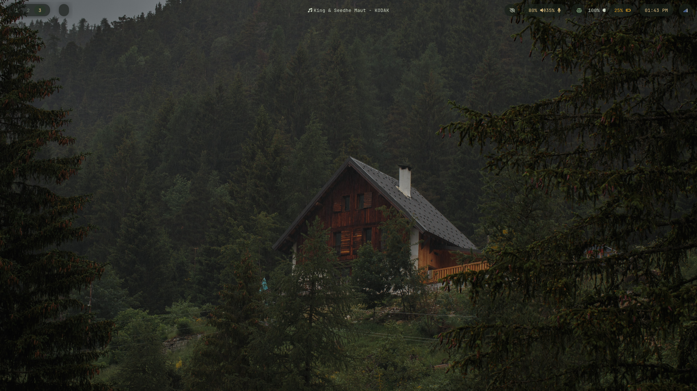

#  Arch Linux — SwayFX Rice

A minimal, forest-inspired Wayland setup built on Arch Linux using SwayFX.

Clean. Calm. Focused.



## 🖥️ Environment

- **OS:** Arch Linux
- **WM:** SwayFX (Wayland)
- **Bar:** Waybar
- **Launcher:** Wofi
- **Terminal:** Kitty
- **Lockscreen:** Swaylock
- **File Manager:** Thunar

## 🎨 Fonts

- **Primary Font:** JetBrains Mono
- **Icon Font (Waybar):** JetBrainsMono Nerd Font

## ✨ Features

- Subtle transparency
- Forest-inspired wallpaper
- Minimal Waybar layout
- Lightweight Wayland workflow
- Clean typography
- Distraction-free workspace


## 📁 Structure
```
dotfiles/
├── sway/
├── waybar/
├── wofi/
├── swaylock/
├── kitty/
└── qt5ct/
```


## 🚀 Installation

Clone the repository:

```bash
git clone https://github.com/your-username/dotfiles.git
cd dotfiles
```

Copy configuration files:

```bash
cp -r sway ~/.config/
cp -r waybar ~/.config/
cp -r wofi ~/.config/
cp -r kitty ~/.config/
cp -r swaylock ~/.config/
```

Reload SwayFX:

```bash
swaymsg reload
```

## 📦 Required Packages

```bash
sudo pacman -S swayfx waybar wofi kitty swaylock thunar qt5ct
```

## 🎯 Philosophy

This setup is built around:

* Simplicity over complexity
* Function over clutter
* A calm visual environment

Designed for long coding sessions without visual noise.

